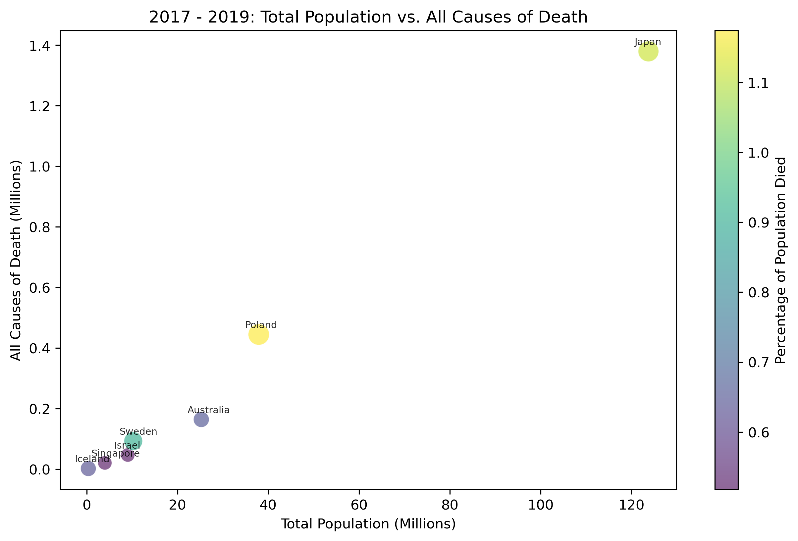
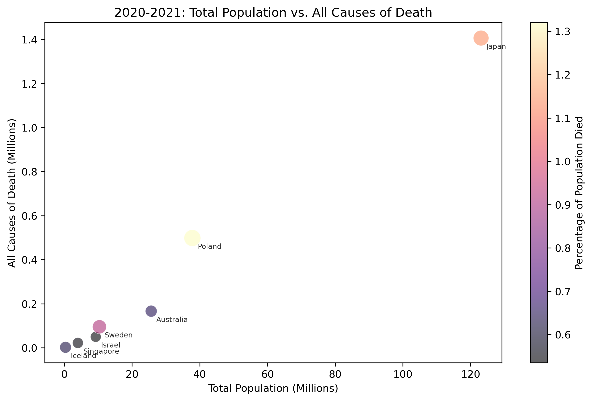

# WHO Mortality Trends: 2017-2021

## Project Overview

This project includes data analysis with Python, Pandas, and Matplotlib for the World Health Organization (WHO) mortality data from 2017 - 2021.

- [Proposal Link (Google Docs)](https://docs.google.com/document/d/1WR-3B-1iszChYkx3cBd1c117qlKFfT9cM7boVALNFx0/edit)
- [Summary Presentation (Google Slides)](https://docs.google.com/presentation/d/1zDFOMUjt6WJLFuCOu5crLI_SgaHIN3Imq4bwdalwgR8/edit#slide=id.g2f251018676_0_55)

Key contributors: Jack Kuppuswamy, Jenn Allen, Rian King, Shyla Tatum, Vaughan Roberts

## Research
The objective of this project is to analyze the cause of death (morbidity, co-morbidity) and overall mortality statistics from two years before the COVID-19 pandemic (2017-2019), during the pandemic (2020-2021) to the amount of data that we have. The research initially scoped with data sources from the CDC, Governmental Health Departments and the WHO. Scope definition and execution resulted with COVID19 coverage as a global story with a sub-selection of countries based on the WHO datasets. 

Researchers: Rian King, Vaughan Roberts, Shyla Tatum

[Research Questions](./resources/documentation/Research_Questions.md)
[Country COVID Response Findings](./resources/documentation/Country%20Covid%20Response.xlsx)
[COVID Response by Country Citations](./resources/documentation/Covid%20Response%20by%20Country%20Citations.docx)

## In-Depth Analysis

All analysis looks closely at the association of ICD (International Classification of Diseases) codes to the WHO mortality data.

List of workbooks used for analysis:

- Gender Analysis, Shyla Tatum - [View Juypter Notebook](./analysis_findings/workbooks/WHO_vizualizations_statum.ipynb)
- Mortality Predictions, Rian King - [View Juypter Notebook](./analysis_findings/workbooks/Profit_Predictions_rking.ipynb)
- Mortality Age Group Visualizations, Jack Kuppuswamy - [View Juypter Notebook](./analysis_findings/workbooks/mortality_agegroup_visualizations_jkuppuswamy.ipynb)
- Add Section Title Here, Vaughan Roberts - [View Juypter Notebook](./analysis_findings/workbooks/visualizations_VRO.ipynb)
- Population and Mortality Relationships, Jenn Allen - [View Juypter Notebook](./analysis_findings/workbooks/population_death_analysis_jallen.ipynb)

### Analysis: Gender Analysis, Shyla Tatum

[View Juypter Notebook](./analysis_findings/workbooks/WHO_vizualizations_statum.ipynb)

Gender was graphed by year as a side-by-side comparison. The data was grouped and then cleaned to the relevant data. Gender was also analyzed by grouping by country and then graphing female to the left and males to the right by total deaths during the 5 years.

#### Citations

- [turn off scientific notation](https://www.tutorialspoint.com/prevent-scientific-notation-in-matplotlib-pyplot)
- [colors](https://matplotlib.org/stable/gallery/color/named_colors.html)
- [matplotlib table types](https://matplotlib.org/stable/plot_types/index.html)
- [filter using OR](https://www.statology.org/or-operator-in-pandas/)
- [Changing the color](https://stackoverflow.com/questions/63460213/how-to-define-colors-in-a-figure-using-plotly-graph-objects-and-plotly-express)

### Analysis: (Mortality Predictions), Rian King
[View Juypter Notebook](./analysis_findings/workbooks/Profit_Predictions_rking.ipynb)

#### Mortality Predictions Summary

This part of the project focuses on predicting mortality outcomes using time series forecasting and machine learning techniques. The primary objective is to create accurate mortality predictions across multiple countries, leveraging historical data and advanced algorithms.

#### Objectives

- **Data Collection**: Utilize World Health Organization (WHO) data, specifically mortality statistics across 12 countries, to build a comprehensive dataset.
- **Data Processing**: Preprocess and clean the WHO data to ensure accuracy and consistency for model training and predictions.
- **Time Series Forecasting**: Implement Facebook's Prophet model to forecast mortality trends over time, accommodating for seasonality, holidays, and other temporal patterns.
- **Country-Specific Predictions**: Generate and analyze mortality predictions for each of the 12 countries, considering unique demographic and healthcare-related factors.
- **Model Evaluation**: Evaluate the accuracy and reliability of the Prophet model's predictions using relevant metrics such as Mean Absolute Error (MAE) and Root Mean Square Error (RMSE).
- **Interpretability**: Provide insights into the factors driving mortality trends in each country, to inform public health policies and interventions.

#### Technologies Used

- **Python**: Core programming language for data processing, model development, and evaluation.
- **Prophet**: For time series forecasting and generating mortality predictions.
- **Pandas**: For data manipulation and analysis.
- **Matplotlib/Seaborn**: For data visualization and exploring trends.
- **Jupyter Notebook**: For interactive development and documentation.

#### WHO Data

The project utilizes mortality data provided by the World Health Organization, focusing on 12 diverse countries. This data includes various health and demographic indicators, allowing for a nuanced analysis of mortality trends across different regions.

#### Predictions Across 12 Countries

The analysis provides mortality forecasts for each of the 12 countries, highlighting differences and commonalities in mortality trends. The predictions help identify potential areas of concern for public health and can guide targeted interventions to reduce mortality rates.

### Analysis: (Mortality Age Group Visualizations), Jack Kuppuswamy

[View Juypter Notebook](./analysis_findings/workbooks/mortality_agegroup_visualizations_jkuppuswamy.ipynb)

The Jupyter Notebook `mortality_agegroup_visualizations.ipynb` provides visualizations of mortality data across different age groups and ICD categories over the years. The visualizations help in understanding trends and patterns in mortality rates, especially within specific age groups and disease categories.

#### Key Features

- **Mortality by Age Group**: Visualizes mortality trends across different age groups over a set of years.
- **Mortality by ICD Category**: Visualizes mortality trends across various ICD categories, highlighting the leading causes of death.
- **Customization**: Includes features like color maps, labels, legends, and axis formatting to enhance the readability and presentation of the data.

#### Analysis Contents

##### Plotting Mortality by Age Group

- A line plot is generated to visualize mortality data for different age groups from 2017 to 2021.
- The plot includes labels for the axes, a title, a legend, and specific formatting to enhance readability.

##### Plotting Mortality by ICD Category

- A set of line plots is created to showcase mortality trends by ICD category over the same period for different age groups listed below.
  - 0-1 Year
  - 1-24 Years
  - 25-44 Years
  - 45-69 Years
  - 70-95+ Years

Similar customization features are applied, including setting axis limits, customizing tick marks, and positioning the legend.

## Customization

The plots can be customized further by modifying parameters in the plotting functions, such as changing the color map, adjusting axis labels, or adding additional data points.

### Analysis: (Add Section Title Here), Vaughan Roberts

[View Juypter Notebook](./analysis_findings/workbooks/visualizations_VRO.ipynb)

Selected country group (four) based on reporting activity counts of lowest and highest for total deaths and total covid-19 deaths. 

### Analysis: Population and Mortality Relationships, Jenn Allen

[View Jupyter Workbook](./analysis_findings/workbooks/population_death_analysis_jallen.ipynb)

This analysis looks at how population impacts the average mortality rate, broken up between time windows: 2017-2019. Our findings show that population size and the total number of deaths are strongly correlated. This is not surprising. However, our analysis uncovered that Japan has a larger overall percentage of its population dying relative to other populations. We also saw COVID-19 did not show up as one of the top 5 causes of death in Japan in 2020 or 2021.

The population data is sourced from the WHO dataset and was cleaned using this [Jupyter Notebook](./cleaned_data/who_pop_cleaning_workbook.ipynb). The workbook imports the cleaned mortality CSV and merges the datasets. We found that most countries did not have WHO population data for this timeframe, which reduced our overall number of countries to report.





## How to Run this Project

### Requirements

- Ensure you have Python installed (preferably version 3.6 or higher).
- Install the necessary Python packages by running the packages specified in the Notebook's imports section. For instance:
  
     ```bash
     pip install pandas matplotlib notebook
     ```

### Running the Notebooks

First, clone this repository and then open the notebook file you want to see the analysis for in VSCode or with Jupyter Server. See each analysis section above for the direct links to each exploration.

#### Run with VSCode

1. Open the notebook in VSCode.
2. Click `Run All` to run the analysis and view the visualizations.

#### Run with Jupyter Server

1. Open the terminal and navigate to the directory containing the notebook
2. Launch Jupyter Notebook by typing:

     ```bash
     jupyter notebook
     ```

3. Open the notebook (`example_workbook_name_here`) in the browser and run the cells.

## Contributing

Contributions, issues, and feature requests are welcome! Fork the repository, create a branch, make your changes, and submit a pull request.
